# Homework cassandra 1

## Init items collection
```
CREATE TABLE cycling.items (
  id uuid,
  category text,
  price float,
  name text,
  producer text,

  info map<text, text>,
   
  PRIMARY KEY (category, id)
);
```

```
INSERT INTO cycling.items
(id, category, price, name, producer, info)
VALUES (
  now(),
  'phone',
  600,
  'iphone x',
  'Apple',
  {'OS': 'IOS', 'memory': '128'}
);
INSERT INTO cycling.items
(id, category, price, name, producer, info)
VALUES (
  now(),
  'phone',
  900,
  'samsung galaxy 10',
  'Samsung',
  {'OS': 'Android', 'memory': '256'}
);
INSERT INTO cycling.items
(id, category, price, name, producer, info)
VALUES (
  now(),
  'phone',
  300,
  'mi A6',
  'Xiaomi',
  {'OS': 'Android', 'memory': '64'}
);
INSERT INTO cycling.items
(id, category, price, name, producer, info)
VALUES (
  now(),
  'shoe',
  150,
  'Super model 3',
  'Adidas',
  {'size': '42'}
);
INSERT INTO cycling.items
(id, category, price, name, producer, info)
VALUES (
  now(),
  'shoe',
  150,
  'Pro runner 4',
  'Nike',
  {'size': '38'}
);
```
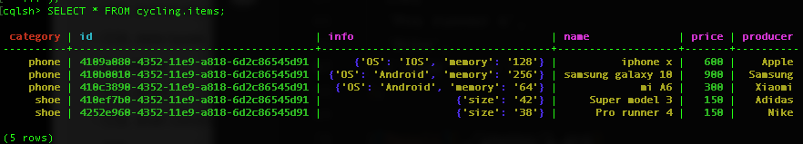


## 1) Напишіть запит, який показує структуру створеної таблиці (команда DESCRIBE)

```
DESCRIBE cycling.items

-----
CREATE TABLE cycling.items (
    category text,
    id uuid,
    info map<text, text>,
    name text,
    price float,
    producer text,
    PRIMARY KEY (category, id)
) WITH CLUSTERING ORDER BY (id ASC)
    AND bloom_filter_fp_chance = 0.01
    AND caching = {'keys': 'ALL', 'rows_per_partition': 'NONE'}
    AND comment = ''
    AND compaction = {'class': 'org.apache.cassandra.db.compaction.SizeTieredCompactionStrategy', 'max_threshold': '32', 'min_threshold': '4'}
    AND compression = {'chunk_length_in_kb': '64', 'class': 'org.apache.cassandra.io.compress.LZ4Compressor'}
    AND crc_check_chance = 1.0
    AND dclocal_read_repair_chance = 0.1
    AND default_time_to_live = 0
    AND gc_grace_seconds = 864000
    AND max_index_interval = 2048
    AND memtable_flush_period_in_ms = 0
    AND min_index_interval = 128
    AND read_repair_chance = 0.0
    AND speculative_retry = '99PERCENTILE';
```

## 2) Напишіть запит, який виведіть усі товари в певній категорії відсортовані за ціною

```
SELECT * FROM cycling.items WHERE category='phone';
```
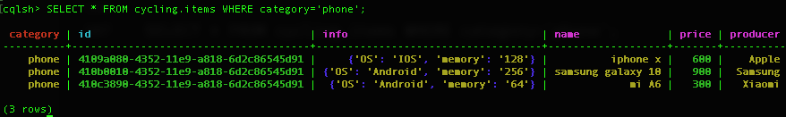

## 3) Напишіть запити, які вибирають товари за різними критеріями в межах певної категорії:

### a) назва
```
SELECT * FROM cycling.items WHERE category='phone' AND name='iphone x' ALLOW FILTERING;
```
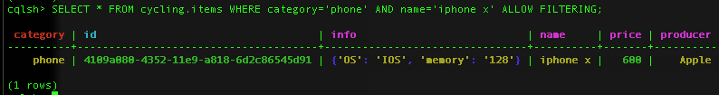


### b) ціна (в проміжку)
```
SELECT * FROM cycling.items WHERE category='phone' AND price < 1000 AND price > 300 ALLOW FILTERING;
```
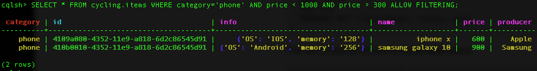


### c) ціна та виробник 
```
SELECT * FROM cycling.items WHERE category='phone' AND price=300 AND producer='Xiaomi' ALLOW FILTERING;
```
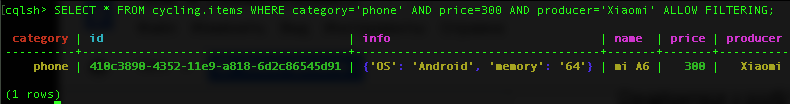

## 4) Напишіть запити, які вибирають товари за:

### a) наявність певних характеристик

```
SELECT * FROM cycling.items WHERE info CONTAINS KEY 'size' ALLOW FILTERING;
```
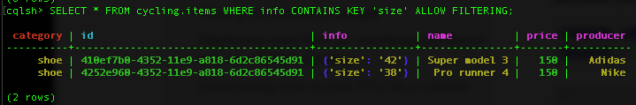

### b) певна характеристика та її значення

```
SELECT * FROM cycling.items WHERE info['size'] = '42' ALLOW FILTERING;
```
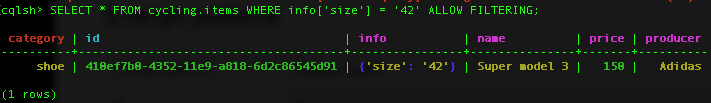

## 5) Оновить опис товару:

### a) змінить існуючі значення певної характеристики 

```
UPDATE cycling.items
SET info['size']='41'
WHERE category='shoe' AND id=410ef7b0-4352-11e9-a818-6d2c86545d91;
```
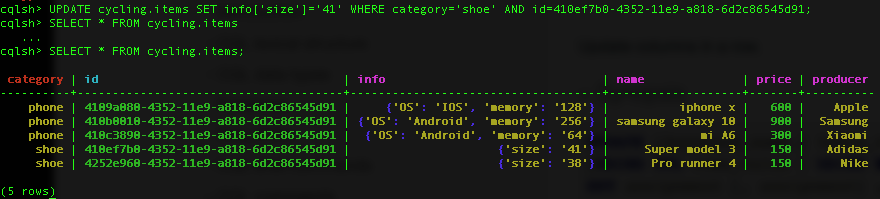

### b) додайте нові властивості (характеристики) товару

```
UPDATE cycling.items
SET info['type']='casual'
WHERE category='shoe' AND id=410ef7b0-4352-11e9-a818-6d2c86545d91;
```
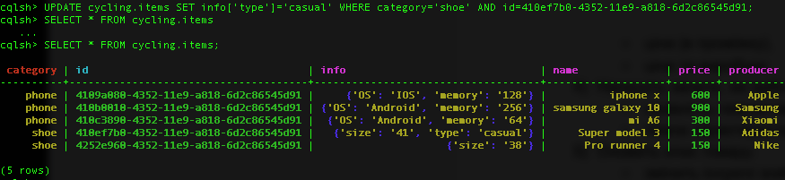

### c) видалить характеристику товару

```
cqlsh> DELETE info['type']
FROM cycling.items
WHERE category='shoe' AND id=410ef7b0-4352-11e9-a818-6d2c86545d91;

```
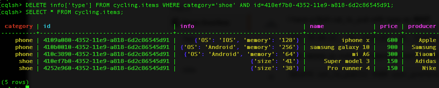

## Створіть таблицю orders в якій міститься ім'я замовника і інформація про замовлення. Для кожного замовника повинна бути можливість швидко шукати його замовлення і виконувати по них запити.

```
cqlsh> CREATE TABLE cycling.orders (
  customer text,
  id uuid,
  createddate date,
  items set<uuid>,
  price float,
  PRIMARY KEY (customer, createddate)
)
WITH CLUSTERING ORDER BY (createddate ASC);

```
Insert dump data:
```
// 1st order
INSERT INTO cycling.orders
(customer, createdDate, id, items, price)
VALUES ('Anton',toDate(now()),now(),{}, 750);

UPDATE cycling.orders
SET items = items + {410ef7b0-4352-11e9-a818-6d2c86545d91}
WHERE customer='Anton' AND id=c424df61-437b-11e9-a818-6d2c86545d91;

UPDATE cycling.orders
SET items = items + {4109a080-4352-11e9-a818-6d2c86545d91}
WHERE customer='Anton' AND id=c424df61-437b-11e9-a818-6d2c86545d91;

// 2nd order
INSERT INTO cycling.orders
  (customer, createdDate, id, items, price)
  VALUES ('Anton',toDate('2019-01-01'),now(),{}, 450);

UPDATE cycling.orders
SET items = items + {4252e960-4352-11e9-a818-6d2c86545d91}
WHERE customer='Anton' AND id=6749bba0-4379-11e9-a818-6d2c86545d91;

UPDATE cycling.orders
SET items = items + {410c3890-4352-11e9-a818-6d2c86545d91}
WHERE customer='Anton' AND id=6749bba0-4379-11e9-a818-6d2c86545d91;
```
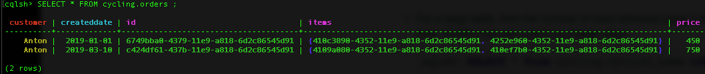


## 1) Напишіть запит, який показує структуру створеної таблиці (команда DESCRIBE)

```
cqlsh> DESCRIBE cycling.orders 

CREATE TABLE cycling.orders (
    customer text,
    id uuid,
    createddate date,
    items set<uuid>,
    price float,
    PRIMARY KEY (customer, id)
) WITH CLUSTERING ORDER BY (id ASC)
    AND bloom_filter_fp_chance = 0.01
    AND caching = {'keys': 'ALL', 'rows_per_partition': 'NONE'}
    AND comment = ''
    AND compaction = {'class': 'org.apache.cassandra.db.compaction.SizeTieredCompactionStrategy', 'max_threshold': '32', 'min_threshold': '4'}
    AND compression = {'chunk_length_in_kb': '64', 'class': 'org.apache.cassandra.io.compress.LZ4Compressor'}
    AND crc_check_chance = 1.0
    AND dclocal_read_repair_chance = 0.1
    AND default_time_to_live = 0
    AND gc_grace_seconds = 864000
    AND max_index_interval = 2048
    AND memtable_flush_period_in_ms = 0
    AND min_index_interval = 128
    AND read_repair_chance = 0.0
    AND speculative_retry = '99PERCENTILE';
```

## 2) Для замовника виведіть всі його замовлення відсортовані за часом коли вони були зроблені

```
SELECT * FROM cycling.orders WHERE customer='Anton' ORDER BY createddate;
```
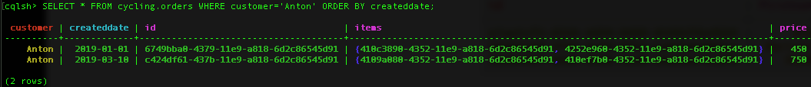

## 3) Для замовника знайдіть замовлення з певним товаром
```
SELECT * FROM cycling.orders
WHERE customer='Anton' AND items CONTAINS 4109a080-4352-11e9-a818-6d2c86545d91
ALLOW FILTERING;
```
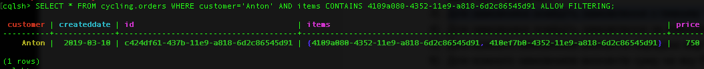

## 4) Для замовника знайдіть замовлення за певний період і їх кількість
```
SELECT * FROM cycling.orders
WHERE customer='Anton' AND createddate < toDate('2020-01-01') AND createddate > toDate('2019-02-02');
```
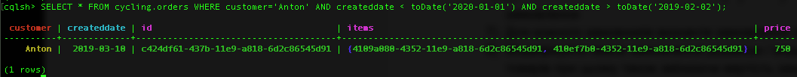
```
SELECT COUNT(*) FROM cycling.orders
WHERE customer='Anton' AND createddate < toDate('2020-01-01') AND createddate > toDate('2019-02-02');
--
Result: 1
```

Let's add new order for Andrew
```
INSERT INTO cycling.orders
   (customer, createdDate, id, items, price)
   VALUES ('Andrew',toDate(now()),now(),{}, 150);

UPDATE cycling.orders
  SET items = items + {410c3890-4352-11e9-a818-6d2c86545d91}
  WHERE customer='Andrew' AND createddate=todate('2019-03-10');

Result:
   customer | createddate | id                                   | items                                                                        | price
----------+-------------+--------------------------------------+------------------------------------------------------------------------------+-------
   Andrew |  2019-03-10 | f86eebf1-437e-11e9-a818-6d2c86545d91 |                                       {410c3890-4352-11e9-a818-6d2c86545d91} |   150
```

## 5) Для кожного замовників визначте середню вартість замовлення
```
SELECT avg(price), customer FROM cycling.orders GROUP BY customer;
```
```
 system.avg(price) | customer
-------------------+----------
               600 |    Anton
               150 |   Andrew
```

## 6) Для кожного замовників визначте суму на яку були зроблені усі його замовлення
```
SELECT sum(price), customer FROM cycling.orders GROUP BY customer;
```
```
 system.sum(price) | customer
-------------------+----------
              1200 |    Anton
               150 |   Andrew
```

## 7) Для кожного замовників визначте замовлення з максимальною вартістю
```
SELECT max(price), id, customer FROM cycling.orders GROUP BY customer;
```
```
 system.max(price) | id                                   | customer
-------------------+--------------------------------------+----------
               750 | 6749bba0-4379-11e9-a818-6d2c86545d91 |    Anton
               150 | f86eebf1-437e-11e9-a818-6d2c86545d91 |   Andrew
```

## 8) Модифікуйте певне замовлення додавши / видаливши один або кілька товарів при цьому також змінюючи вартість замовлення
```
UPDATE cycling.orders
SET items = items - {410c3890-4352-11e9-a818-6d2c86545d91}, price =150
WHERE customer = 'Anton' AND createddate=toDate('2019-03-10');
```

```
SELECT customer, items, price FROM cycling.orders WHERE customer='Andrew';

 customer | items                                  | price
----------+----------------------------------------+-------
   Andrew | {410c3890-4352-11e9-a818-6d2c86545d91} |   150
```

## 9) Для кожного замовлення виведіть час коли його ціна були занесена в базу (SELECT WRITETIME)

```
SELECT WRITETIME (price), customer, price FROM cycling.orders ;
```
```
 writetime(price) | customer | price
------------------+----------+-------
 1552253726353704 |    Anton |   450
 1552255347714934 |    Anton |   150
 1552254822445494 |   Andrew |   150
```

## 10) Створіть замовлення з певним часом життя (TTL), після якого воно видалиться 
It will live for 10k seconds.
```
INSERT INTO cycling.orders
   (customer, createdDate, id, items, price)
   VALUES ('toDelete',toDate(now()),now(),{}, 150) USING TTL 10000;

SELECT customer FROM cycling.orders;
Result:
 customer
----------
    Anton
    Anton
 ToDelete
   Andrew
```

## 11) Поверніть замовлення у форматі JSON
```
 SELECT json * FROM cycling.orders;
```
```
{"customer": "Anton", "createddate": "2019-01-01", "id": "6749bba0-4379-11e9-a818-6d2c86545d91", "items": ["410c3890-4352-11e9-a818-6d2c86545d91", "4252e960-4352-11e9-a818-6d2c86545d91"], "price": 450.0}

 {"customer": "Anton", "createddate": "2019-03-10", "id": "c424df61-437b-11e9-a818-6d2c86545d91", "items": ["4109a080-4352-11e9-a818-6d2c86545d91", "410ef7b0-4352-11e9-a818-6d2c86545d91"], "price": 150.0}

{"customer": "Andrew", "createddate": "2019-03-10", "id": "f86eebf1-437e-11e9-a818-6d2c86545d91", "items": ["410c3890-4352-11e9-a818-6d2c86545d91"], "price": 150.0}
```

## 12) Додайте замовлення у форматі JSON
```
INSERT INTO cycling.orders JSON '{
  "customer": "jsonName",
  "id": "829aa84a-4bba-411f-a4fb-38167a987cda",
  "createddate": "2019-01-02",
  "items": ["410ef7b0-4352-11e9-a818-6d2c86545d91"]
}';
```
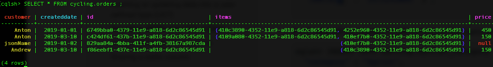
