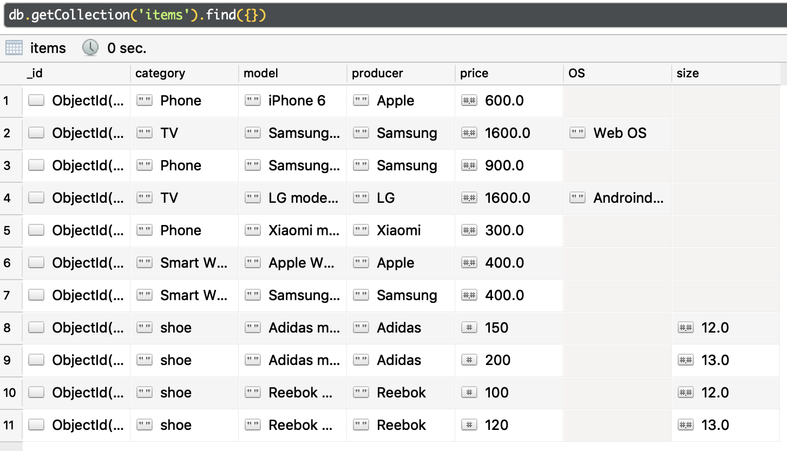
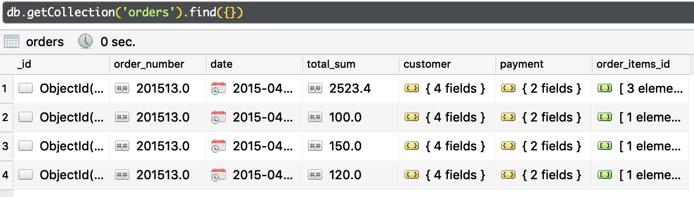

Використовуйте дані та колекції з завдання 2.
# Використовуючи підхід Map/Reduce напишіть наступні запити. Деякі з запитів простіше робити через два Map/Reduce

Let's remmember what do we have in db already.



## 1. Підрахувати скільки одиниць товару є у кожного виробника ("producer")

```
db.getCollection('items').mapReduce(
    function() { emit(this.producer, 1) },
    function(key, values) { return Array.sum(values) },
    { out: { inline: 1 } }
)
```

```
/* 1 */
{
    "results" : [ 
        {
            "_id" : "Adidas",
            "value" : 2.0
        }, 
        {
            "_id" : "Apple",
            "value" : 2.0
        }, 
        {
            "_id" : "LG",
            "value" : 1.0
        }, 
        {
            "_id" : "Reebok",
            "value" : 2.0
        }, 
        {
            "_id" : "Samsung",
            "value" : 3.0
        }, 
        {
            "_id" : "Xiaomi",
            "value" : 1.0
        }
    ],
    ...
}
```

## 2. Підрахувати загальну вартість товарів у кожного виробника ("producer")

```
db.getCollection('items').mapReduce(
    function() { emit(this.producer, this.price) },
    function(key, values) { return Array.sum(values) },
    { out: { inline: 1 } }
)
```

```
{
    "results" : [ 
        {
            "_id" : "Adidas",
            "value" : 350.0
        }, 
        {
            "_id" : "Apple",
            "value" : 1000.0
        }, 
        {
            "_id" : "LG",
            "value" : 1600.0
        }, 
        {
            "_id" : "Reebok",
            "value" : 220.0
        }, 
        {
            "_id" : "Samsung",
            "value" : 2900.0
        }, 
        {
            "_id" : "Xiaomi",
            "value" : 300.0
        }
    ],
    ...
}
```

## 3. Підрахуйте сумарну вартість замовлень зроблену кожним замовником

Orders that we have:



```
db.getCollection('orders').mapReduce(
    function() {
      emit(this.customer.name + " " + this.customer.surname, this.total_sum)
    },
    function(key, values) { return Array.sum(values) },
    { out: { inline: 1 } }
);
```

```
{
    "results" : [ 
        {
            "_id" : "Andrii Rodinov",
            "value" : 2623.4
        }, 
        {
            "_id" : "Anton Bilchuk",
            "value" : 270.0
        }
    ],
    ...
}
```

## 4. Підрахуйте сумарну вартість замовлень зроблену кожним замовником за певний період часу (використовуйте query condition)


```
db.getCollection('orders').mapReduce(
    function() {
      emit(this.customer.name + " " + this.customer.surname, this.total_sum)
    },
    function(key, values) { return Array.sum(values) },
    { out: { inline: 1 }, query: { date: { $lte: ISODate('2015-04-15'), $gt: ISODate('2015-04-13') } } }
);
```

```
{
    "results" : [ 
        {
            "_id" : "Andrii Rodinov",
            "value" : 100.0
        }, 
        {
            "_id" : "Anton Bilchuk",
            "value" : 150.0
        }
    ],
}
```

## 5. Підрахуйте середню вартість замовлення

```
db.getCollection('orders').mapReduce(
    function() {
      emit(null, this.total_sum)
    },
    function(key, values) { return Array.sum(values)/values.length },
    { out: { inline: 1 } }
);
```

```
{
    "results" : [ 
        {
            "_id" : null,
            "value" : 723.35
        }
    ],
}
```

## 6. Підрахуйте середню вартість замовлення кожного покупця

```
db.getCollection('orders').mapReduce(
    function() {
      emit(this.customer.name + " " + this.customer.surname, this.total_sum)
    },
    function(key, values) { return Array.sum(values)/values.length },
    { out: { inline: 1 } }
);
```

```
{
    "results" : [ 
        {
            "_id" : "Andrii Rodinov",
            "value" : 1311.7
        }, 
        {
            "_id" : "Anton Bilchuk",
            "value" : 135.0
        }
    ],
}
```

## 7. Підрахуйте в скількох замовленнях зустрічався кожен товар (скільки разів він був куплений)

```
db.getCollection('orders').mapReduce(
    function() {
        this.order_items_id.forEach(function (item) {
            emit(item.id, 1)
        })
    },
    function(key, values) { return Array.sum(values) },
    { out: { inline: 1 } }
);
```

```
{
    "results" : [ 
        {
            "_id" : ObjectId("5c7293507cd3913141d94d69"),
            "value" : 1.0
        }, 
        {
            "_id" : ObjectId("5c72969b7cd3913141d94d6b"),
            "value" : 1.0
        }, 
        {
            "_id" : ObjectId("5c72969b7cd3913141d94d6f"),
            "value" : 1.0
        }, 
        {
            "_id" : ObjectId("5c729daf7cd3913141d94d72"),
            "value" : 1.0
        }, 
        {
            "_id" : ObjectId("5c94bb9c3ce46889d28c7611"),
            "value" : 1.0
        }, 
        {
            "_id" : ObjectId("5c94bb9c3ce46889d28c7614"),
            "value" : 2.0
        }
    ],
}
```

## 8. Для кожного товару отримаєте список всіх замовників які купили його

```
db.getCollection('orders').mapReduce(
    function() {
        var self = this;
        this.order_items_id.forEach(function (item) {
            emit(item.id, self.customer.name + " " + self.customer.surname)
        })
    },
    function(key, values) { return values.join(', ') },
    { out: { inline: 1 } }
);
```

```
{
    "results" : [ 
        {
            "_id" : ObjectId("5c7293507cd3913141d94d69"),
            "value" : "Andrii Rodinov"
        }, 
        {
            "_id" : ObjectId("5c72969b7cd3913141d94d6b"),
            "value" : "Andrii Rodinov"
        }, 
        {
            "_id" : ObjectId("5c72969b7cd3913141d94d6f"),
            "value" : "Andrii Rodinov"
        }, 
        {
            "_id" : ObjectId("5c729daf7cd3913141d94d72"),
            "value" : "Andrii Rodinov"
        }, 
        {
            "_id" : ObjectId("5c94bb9c3ce46889d28c7611"),
            "value" : "Anton Bilchuk"
        }, 
        {
            "_id" : ObjectId("5c94bb9c3ce46889d28c7614"),
            "value" : "Andrii Rodinov, Anton Bilchuk"
        }
    ],
}
```

## 9. Отримайте товар та список замовників, які купували його більше одного (двох) разу(ів)

Firstly let's make a mapRedcue which saves how much times customer bought some item.
```
db.getCollection('orders').mapReduce(
    function() {
        var self = this;
        this.order_items_id.forEach(function (item) {
            var customerid =  self.customer.name + " " + self.customer.surname
            emit(item.id + "|" + customerid, { item: item.id, customer: customerid , count: 1 })
        })
    },
    function(key, values) {
        return values.reduce((acc, prev) => {
            return {
                item: prev.item,
                customer: prev.customer,
                count: acc.count + prev.count
            }
        }, { count: 0 }) 
    },
    { out: 'items_orders_per_customer_count'}
);
```

And mapReduce these collection for needed result
```
db.getCollection('items_orders_per_customer_count').mapReduce(
    function() {
        emit(this.value.item, this.value.customer)
    },
    function(key, values) {
        return values.join(', ')
    },
    { out: { inline: 1 }, query: { "value.count": { $gt: 1 } } }
)

{
    "results" : [ 
        {
            "_id" : ObjectId("5c94bb9c3ce46889d28c7614"),
            "value" : "Anton Bilchuk"
        }
    ],
}
```
And
```
db.getCollection('items_orders_per_customer_count').mapReduce(
    function() {
        emit(this.value.item, this.value.customer)
    },
    function(key, values) {
        return values.join(', ')
    },
    { out: { inline: 1 }, query: { "value.count": { $gt: 2 } } }
)

{
    "results" : [ 
        {
            "_id" : ObjectId("5c94bb9c3ce46889d28c7614"),
            "value" : "Anton Bilchuk"
        }
    ],
}
```

## 10. Отримайте топ N товарів за популярністю (тобто топ товарів, які куплялись найчастіше) (функцію sort не застосовувати)

## 11. Отримайте топ N замовників (за сумарною вартістю їх замовлень) (функцію sort не застосовувати)

## 12. Для завдань 3, 4) реалізуйте і​нкрементальний​ Map / Reduce використовуючи out і ​action

```
db.getCollection('orders').mapReduce(
    function() {
      emit(this.customer.name + " " + this.customer.surname, this.total_sum)
    },
    function(key, values) {
      return Array.sum(values)
    },
    {
      out: 'total_order_price_per_customer'
    }
);
```

```
db.getCollection('orders').mapReduce(
    function() {
      emit(this.customer.name + " " + this.customer.surname, this.total_sum)
    },
    function(key, values) { return Array.sum(values) },
    {
      out: 'total_order_price_per_customer_13-14',
      query: {
        date: {
          $lte: ISODate('2015-04-15'),
          $gt: ISODate('2015-04-13')
        }
      }
    }
);
```

## 13. Для кожного замовника, визначить на яку суму їм було зроблено замовлень за кожен місяць цього року та за аналогічний місяць минулого року та динаміку збільшення/зменшення замовлень