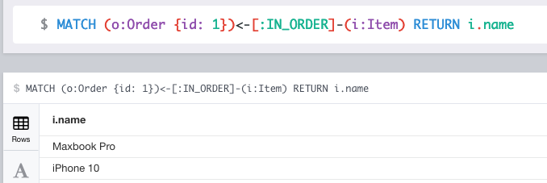

# Змоделювати наступну предметну область:
- Є: Items, Customers, Orders
- Customer може додати Item(s) до Order (тобто купити Товар)
- У Customer може бути багато Orders
- Item може входити в багато Orders
- Customer може переглядати (view), але при цьому не купувати Items 

```
// Items
CREATE (iphone10:Item {name:'iPhone 10' })
CREATE (samsungG10:Item {name:'Samsung galaxy 10' })
CREATE (miPhone6:Item {name:'Xiaomi mi 6' })
CREATE (macbookPro:Item {name:'Maxbook Pro' })
CREATE (dellLaptop:Item {name:'Dell laptop' })
CREATE (miLaptop:Item {name:'Xiaomi laptop' })
// Customers
CREATE (anton:Customer {name:'Anton' })
CREATE (andrew:Customer {name:'Andrew' })
CREATE (max:Customer {name:'Max' })
// Orders
CREATE (antonOrder:Order {id: 1})
CREATE (antonOrder2:Order {id: 2})
CREATE (andrewOrder:Order {id: 3})
CREATE (maxOrder:Order {id: 4})

// connections
CREATE
  (anton)-[:ORDERED]->(antonOrder),
  (anton)-[:ORDERED]->(antonOrder2),
  (andrew)-[:ORDERED]->(andrewOrder),
  (max)-[:ORDERED]->(maxOrder),
  (iphone10)-[:IN_ORDER]->(antonOrder),
  (macbookPro)-[:IN_ORDER]->(antonOrder),
  (dellLaptop)-[:IN_ORDER]->(antonOrder2),
  (miPhone6)-[:IN_ORDER]->(andrewOrder),
  (miLaptop)-[:IN_ORDER]->(maxOrder),
  (anton)-[:VIEWED]->(iphone10),
  (anton)-[:VIEWED]->(samsungG10),
  (anton)-[:VIEWED]->(macbookPro),
  (anton)-[:VIEWED]->(dellLaptop),
  (andrew)-[:VIEWED]->(samsungG10),
  (andrew)-[:VIEWED]->(miPhone6),
  (max)-[:VIEWED]->(dellLaptop),
  (max)-[:VIEWED]->(miLaptop)
```

## Знайти Items які входять в конкретний Order
```
MATCH (o:Order {id: 1})<-[:IN_ORDER]-(i:Item) RETURN i.name
```
Result:
