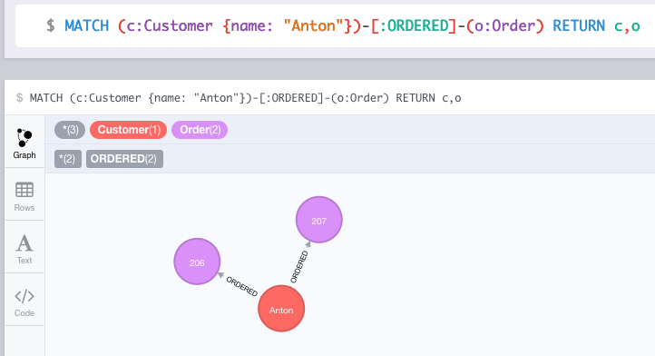
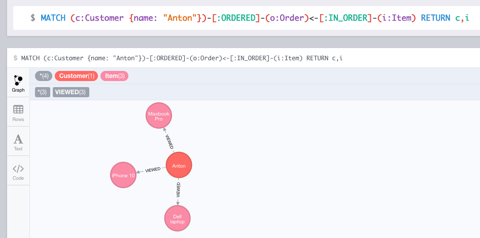
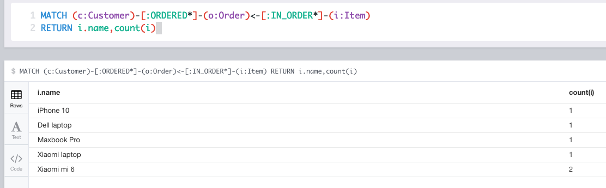
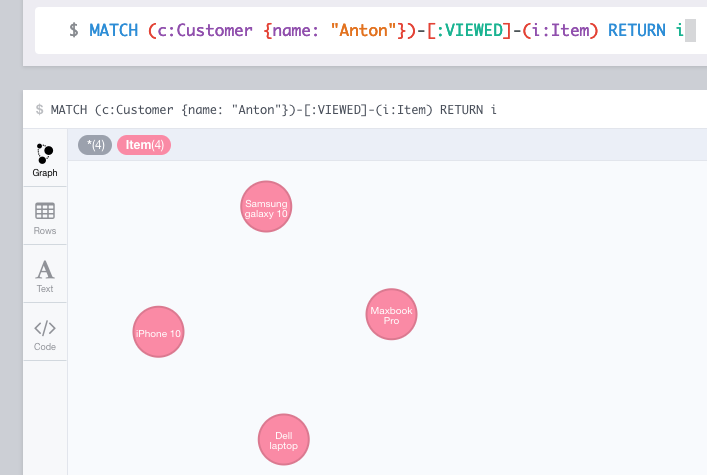
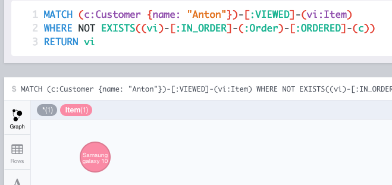
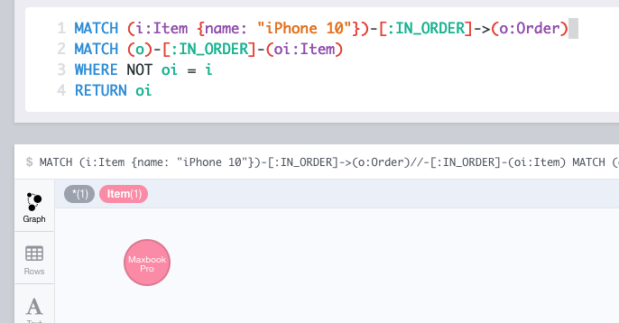
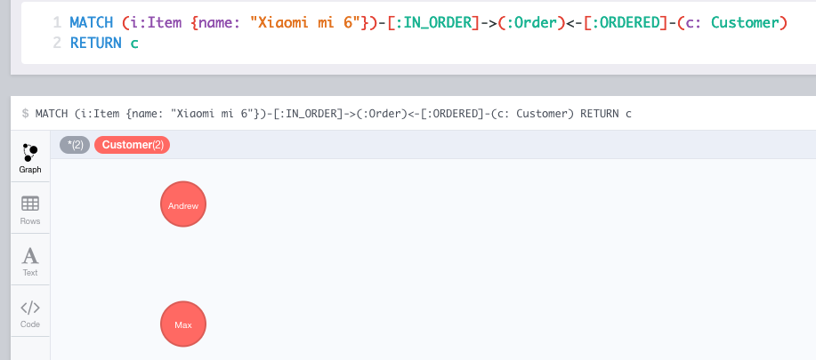
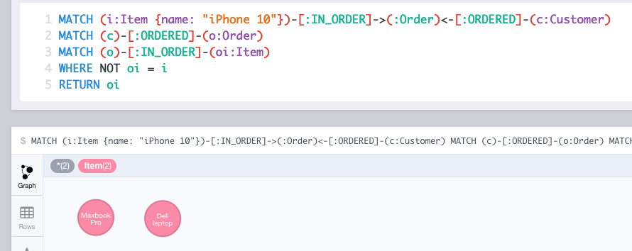
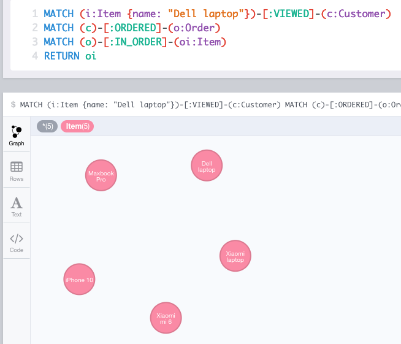

# Змоделювати наступну предметну область:
- Є: Items, Customers, Orders
- Customer може додати Item(s) до Order (тобто купити Товар)
- У Customer може бути багато Orders
- Item може входити в багато Orders
- Customer може переглядати (view), але при цьому не купувати Items 

```
// Items
CREATE (iphone10:Item {name:'iPhone 10' })
CREATE (samsungG10:Item {name:'Samsung galaxy 10' })
CREATE (miPhone6:Item {name:'Xiaomi mi 6' })
CREATE (macbookPro:Item {name:'Maxbook Pro' })
CREATE (dellLaptop:Item {name:'Dell laptop' })
CREATE (miLaptop:Item {name:'Xiaomi laptop' })
// Customers
CREATE (anton:Customer {name:'Anton' })
CREATE (andrew:Customer {name:'Andrew' })
CREATE (max:Customer {name:'Max' })
// Orders
CREATE (antonOrder:Order {id: 1})
CREATE (antonOrder2:Order {id: 2})
CREATE (andrewOrder:Order {id: 3})
CREATE (maxOrder:Order {id: 4})

// connections
CREATE
  (anton)-[:ORDERED]->(antonOrder),
  (anton)-[:ORDERED]->(antonOrder2),
  (andrew)-[:ORDERED]->(andrewOrder),
  (max)-[:ORDERED]->(maxOrder),
  (iphone10)-[:IN_ORDER]->(antonOrder),
  (macbookPro)-[:IN_ORDER]->(antonOrder),
  (dellLaptop)-[:IN_ORDER]->(antonOrder2),
  (miPhone6)-[:IN_ORDER]->(andrewOrder),
  (miLaptop)-[:IN_ORDER]->(maxOrder),
  (anton)-[:VIEWED]->(iphone10),
  (anton)-[:VIEWED]->(samsungG10),
  (anton)-[:VIEWED]->(macbookPro),
  (anton)-[:VIEWED]->(dellLaptop),
  (andrew)-[:VIEWED]->(samsungG10),
  (andrew)-[:VIEWED]->(miPhone6),
  (max)-[:VIEWED]->(dellLaptop),
  (max)-[:VIEWED]->(miLaptop)
```

## 1. Знайти Items які входять в конкретний Order
```
MATCH (o:Order {id: 1})<-[:IN_ORDER]-(i:Item) RETURN i.name
```
Result:


## 2. Знайти всі Orders конкретного Customer
```
MATCH (c:Customer {name: "Anton"})-[:ORDERED]-(o:Order) RETURN c,o
```
Result:



## 3. Знайти всі Items куплені конкретним Customer
```
MATCH (c:Customer {name: "Anton"})-[:ORDERED]-(o:Order)<-[:IN_ORDER]-(i:Item) RETURN c,i
```
Result:



## 4. Знайти кількість Items куплені конкретним Customer
```
MATCH (c:Customer {name: "Anton"})-[:ORDERED]-(o:Order)<-[:IN_ORDER]-(i:Item) RETURN count(i)
```
Result: `3`

## 5. Знайті скільки разів кожен товар був придбаний
Let's add miPhone6 item to max's order. It will make expected results more interesting.
```
MATCH (miPhone6:Item {name: "Xiaomi mi 6"}), (maxOrder:Order {id: 4})
CREATE (miPhone6)-[:IN_ORDER]->(maxOrder)
```
And now count how many time each item was ordered:
```
MATCH (c:Customer)-[:ORDERED*]-(o:Order)<-[:IN_ORDER*]-(i:Item)
RETURN i.name,count(i)
```


## 6. Знайти всі Items переглянуті (view) конкретним Customer
```
MATCH (c:Customer {name: "Anton"})-[:VIEWED]-(i:Item) RETURN i
```


## 7. Знайти всі Items переглянуті (view), але не куплені конкретним Customer

```
MATCH (c:Customer {name: "Anton"})-[:VIEWED]-(vi:Item)
WHERE NOT EXISTS((vi)-[:IN_ORDER]-(:Order)-[:ORDERED]-(c))
RETURN vi
```


## 8. Знайти Items що куплені разом з конкретним Item (тобто все Items що входять до Order разом з даними Item)

Maybe not the best algorithm. I get iphone item, find orders with it, find items from these orders and at the end filter out iphone item.
```
MATCH (i:Item {name: "iPhone 10"})-[:IN_ORDER]->(o:Order)
MATCH (o)-[:IN_ORDER]-(oi:Item)
WHERE NOT oi = i
RETURN oi
```


## 9. Знайти Customers які купили даний конкретний Item

```
MATCH (i:Item {name: "Xiaomi mi 6"})-[:IN_ORDER]->(:Order)<-[:ORDERED]-(c: Customer)
RETURN c
```


## 10. Знайти всі Items куплені Customer(s) які купили даний конкретний Item

```
MATCH (i:Item {name: "iPhone 10"})-[:IN_ORDER]->(:Order)<-[:ORDERED]-(c:Customer)
MATCH (c)-[:ORDERED]-(o:Order)
MATCH (o)-[:IN_ORDER]-(oi:Item)
WHERE NOT oi = i
RETURN oi
```


## 11. Знайти всі Items куплені Customer(s) який переглядав даний конкретний Item

```
MATCH (i:Item {name: "Dell laptop"})-[:VIEWED]-(c:Customer)
MATCH (c)-[:ORDERED]-(o:Order)
MATCH (o)-[:IN_ORDER]-(oi:Item)
RETURN oi
```


## 12. Знайти для певного Customer(а) товари, які він переглядав, але не купив

The same as 7)